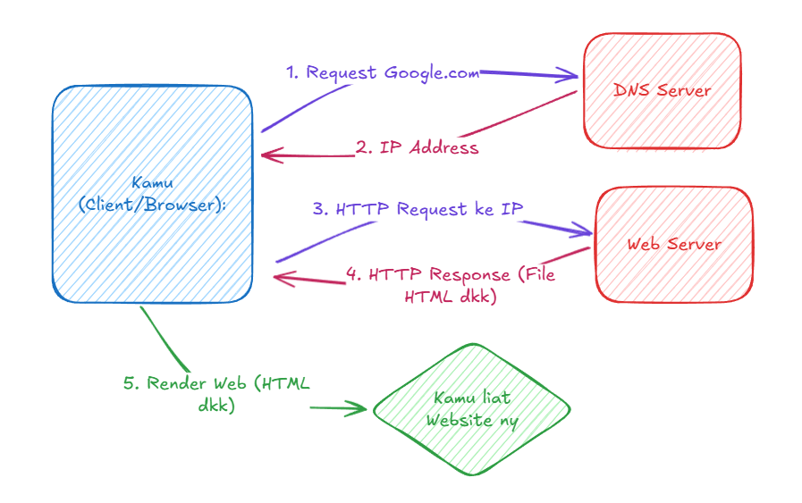
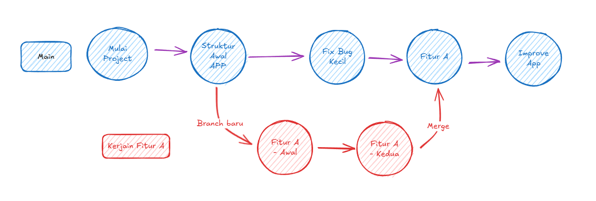

<!-- _class: lead -->
# Web Development Basics
## Session 1: Basic Web dan Tools" yang dipake

---

## Halo ヽ（≧□≦）ノ 👋

* Semangat mulai perjalanan jadi Web DEv
* Hari ini kita bakal mulai dari dasar-dasarnya dulu
* Bebas tanya kapan aja coy

* **Goals for Today:** Tau fundamental cara kerja web, kenalan dulu sama tools" penting, dan siapin lingkungan buat ngoding.

---

## Agenda

1) **Cek Kesiapan** (Udah siap belum nih?)
2) **Gimana Sih Cara Kerja Web?** (Gambaran besarnya dulu)
3) **Peralatan Tempur Kita:** Software yang bakal dipakai 
   * Web Browser
   * Text Editor (VS Code)
   * Command Line Interface (CLI)
   * Git (Buat _version control_)
4) **Hands On: Setup Command Line & Git, HTML**

---

## 1. Udah Siap Belum nih?

* **File & Folder:** Kalian harusny udah cukup nyaman buat bikin, nyari, dan ngatur file atau folder di komputermu
* **Web Browser:** Pasti tiap hari pake kan? (Chrome, Firefox, Edge, Safari). Nanti kita bakal pakai developer tools-nya juga.
* **Koneksi Internet:** Penting banget buat download tools dan akses materi.
    * *Ada yang mau ditanyain ga sebelum mulai lebih dalam?*


---

<!-- _class: font-kecil -->

## 2. Gimana Sih Cara Kerja Web?

Bayangin kamu lagi mesen pizza:

1) **Kamu (Client/Browser):** Pengen makan pizza (baca: buka halaman web). Kamu cari nomornya — misalnya `google.com`
2) **Buku Telepon (DNS):** Ngeubah `google.com` jadi alamat IP kayak `172.217.160.142`
3) **Tempat Pizza (Web Server):** Nerima pesenan kamu (permintaan HTTP)
4) **Dapur (Backend):** Masakin pizzanya — isinya HTML, CSS, JS
5) **Pengantaran (HTTP Response):** Kirim pizzanya ke kamu
6) **Enjoy makan!** Browser mu nampilin halaman web-nya


---
<!-- VISUAL -->



---

<!-- _class: font-kecil -->

## 3. Software yang bakal dipakai 

1) **Web Browser:** (Chrome, Firefox)
   * Buat lihat hasil website kita dan akses Developer Tools.
2) **Text Editor:**
   * Tempat kita nulis kode (HTML, CSS, JavaScript).
   * Kita bakal pakai **Visual Studio Code (VS Code)**.
3) **Command Line Interface (CLI):**
   * Cara berinteraksi sama komputer lewat teks.
   * Penting banget buat banyak hal di development, apalagi Git.
   * Windows: Git Bash (bawaan Git) atau PowerShell. macOS/Linux: Terminal.
4) **Git:**
   * _System Version Control_ buat nyimpen dan lacak perubahan di kode kita.

---

### Tool 1: Web Browser (Chrome/Firefox)

* Harusnya udah punya!
* Kita saranin pake **Google Chrome** atau **Mozilla Firefox** karena devtoolsny bagus
* **Developer Tools:** Bisa buat cek HTML, debug CSS, coba-coba JavaScript, dkk (Nanti kita explore lagi)


---

### Tool 2: Text Editor - VS Code

<!-- _class: font-kecil -->

* **Apa itu?** Program khusus buat nulis kode.
* **Kenapa VS Code?**
  * Gratis, open-source, dan super populer.
  * Fitur lengkap: highlight kode, auto-complete, terminal bawaan, banyak ekstension dkk.
* **Cara Install:**
  1. Buka [https://code.visualstudio.com/](https://code.visualstudio.com/)
  2. Download installer sesuai os mu.
* **Install pake CLI:**
  1. Buka terminal/git bash
  2. Run `winget install --id Git.Git -e --source winget` buat Windows
  3. Run `brew install git` Buat MacOS


---

### Tool 3: Command Line Interface (CLI)

* **Apa itu?** Cara berinteraksi sama komputer lewat teks (bukan klik-klik).

  * macOS/Linux: pakai `Terminal`
  * Windows: bisa pakai `Command Prompt`, `PowerShell`, atau `Git Bash` 

* **Kenapa perlu belajar ini?**

  * Lebih efisien buat beberapa tugas.
  * Wajib banget kalau mau pakai Git dan tools developer lainnya.
  * Kasih kontrol yang lebih langsung ke sistem kita.


---

#### Dasar-Dasar Command Line - Gas coba

Buka CLI kamu:

* **macOS:** Pencet Spotlight (Cmd+Spasi), ketik "Terminal", lalu Enter.
* **Windows:** Cari "Terminal", terus buka.
* **Linux:** Tekan Ctrl+Alt+T atau cari "Terminal" di aplikasimu.

---

<!-- _class: tabel-kecil -->

**Perintah Umum di Command Line:**

| Perintah              | Deskripsi                                 | Contoh                            |
| :-------------------- | :---------------------------------------- | :-------------------------------- |
| `pwd`                 | Tampilkan lokasi folder saat ini          | `pwd`                             |
| `ls`                  | Lihat isi folder saat ini                 | `ls` atau `ls -la` (lebih detail) |
| `cd <nama-folder>`    | Pindah ke folder lain                     | `cd Documents`                    |
| `cd ..`               | Naik satu level folder                    | `cd ..`                           |
| `mkdir <nama>`        | Bikin folder baru                         | `mkdir my-project`                |
| `touch <nama-file>`   | Bikin file kosong (atau update timestamp) | `touch index.html`                |
| `clear` / `cls` (Win) | Bersihin layar terminal                   | `clear`                           |


---
<!-- _class: font-kecil-x -->

#### Waktunya Latihan CLI!

1. Buka Terminal atau Git Bash kamu.
2. Cek posisi kamu sekarang: `pwd`
3. Lihat isi foldernya: `ls`
4. Bikin folder baru buat project kita: `mkdir I-RICH`
5. Masuk ke folder itu: `cd I-RICH`
6. Pastikan kamu udah di dalamnya: `pwd` (harusnya diakhiri dengan `/I-RICH`)
7. Bikin folder lagi di dalamnya: `mkdir sesi_1`
8. Masuk ke folder itu: `cd sesi_1`
9. Bikin file kosong: `touch README.md`
10. Lihat isi folder: `ls` (harusnya muncul `README.md`)
11. Balik ke folder `I-RICH`: `cd ..`


---
<!-- _class: font-sedang -->

### Tool 4: Git - Version Control

* **Apa itu Version Control?**
  Sistem yang nyimpen riwayat perubahan file, jadi kita bisa lihat atau balikin ke versi sebelumnya kapan aja.

* **Kenapa pake Git?**

  * **Lacak Riwayat:** Bisa tahu siapa yang ngubah apa, kapan, dan kenapa.
  * **Balikin Perubahan:** Kalau ada yang error, bisa balik ke versi yang aman.
  * **Branching:** Bisa ngerjain fitur baru tanpa ganggu kode utama.
  * **Kolaborasi:** Wajib banget kalau kerja bareng tim.
  * **Backup:** (Kalau disambung ke GitHub/GitLab) Kode kamu aman dan tersimpan online.


---

#### Contoh Git Workflow



---
<!-- _class: font-kecil -->

#### Install Git gas

1) Buka [https://git-scm.com/downloads](https://git-scm.com/downloads)
2) Download installer sesuai sistem operasi kamu.
3) Jalankan installernya:

   * **Windows:** Pilih aja opsi default, tapi pastikan:

     * Centang **"Git Bash Here"** di bagian *Choosing Components*
     * Pilih **"Use Git from Git Bash only"** atau **"Git from the command line and also from 3rd-party software"** di bagian *PATH environment*
     * Untuk editor default, bisa pilih VS Code kalau udah terinstall

   * **macOS:** Ikuti instruksinya, kadang diminta install *Xcode Command Line Tools* kalau belum ada.

**(Kalo ada kesusahan ngomong yaa)**


---
<!-- _class: font-sedang -->

#### Cek Git Udah Keinstall & Set Up Pertama Kali

1) Buka **jendela Terminal / Git Bash yang BARU** (penting setelah instalasi ya).

2) Ketik: `git --version`

   * Harusnya muncul kayak gini: `git version 2.XX.X`

3) **Atur identitas Git kamu:**
   (Supaya Git tahu siapa yang ngedit tiap proyek)

   ```bash
   git config --global user.name "Nama Kamu"
   git config --global user.email "emailkamu@example.com"
   ```

   Ganti `"Nama Kamu"` dan `"emailkamu@example.com"` dengan nama dan email asli kamu ya.


---

#### Git Dasar: Kenalan Dulu Sama Konsep-Konsep Git

* **Repository (Repo):** Folder proyek yang dipantau sama Git. Isinya semua file proyek kamu + riwayat perubahan (disimpan di folder tersembunyi `.git`).
* **Working Directory:** Folder proyek tempat kamu ngedit file secara langsung.
* **Staging Area (Index):** Ruang tunggu buat nyiapin perubahan sebelum disimpan beneran.
* **Commit:** Snapshot atau rekaman perubahan yang kamu simpan ke dalam riwayat repo. Tiap commit punya ID unik dan pesan yang ngejelasin perubahan apa yang dilakukan.

---
<!-- _class: font-kecil-x -->

#### Alur Kerja Dasar Git (Intip Dulu Yuk)

1. **`git init`**: Mulai repo Git baru di folder proyek kamu. (Cukup sekali per proyek)

   ```bash
   git init
   ```

   Ini bakal bikin folder tersembunyi `.git` buat nyimpan semua histori Git.

2. **Edit file** di proyek kamu (misalnya nambahin `notes.txt` atau bikin `index.html`).

3. **`git status`**: Cek status proyek. Git bakal kasih tau file mana yang baru, berubah, atau belum ditrack.

4. **`git add <nama_file>`** atau **`git add .`**: Masukin perubahan ke Staging Area.

   * `git add notes.txt` → masukin file `notes.txt` aja
   * `git add .` → masukin semua perubahan di folder saat ini dan subfoldernya

5. **`git commit -m "Pesan deskriptif"`**: Simpen snapshot dari perubahan kamu.

   ```bash
   git commit -m "Commit Pertama :)"
   ```

---

#### Mengenal Elemen Dasar HTML

* HTML terdiri dari **elemen**.
* Sebagian besar elemen HTML terdiri dari:
    * **Tag Pembuka** (`<nama-elemen>`)
    * **Konten** (teks, elemen lain, dll.)
    * **Tag Penutup** (`</nama-elemen>`)
    * ```html
        <p>Ini adalah sebuah paragraf (Konten)</p>
      ```
---
<!-- _class: tabel-kecil -->

| Elemen               | Tag(s)           | Deskripsi                                        | Contoh                                       |
| :------------------- | :--------------- | :----------------------------------------------- | :------------------------------------------- |
| Judul (Heading)      | `<h1>` - `<h6>` | Menentukan judul atau sub-judul.                 | `<h1>Judul Utama</h1>`                       |
| Paragraf             | `<p>`            | Menentukan blok teks paragraf.                   | `<p>Ini sebuah paragraf.</p>`                |
| Garis Baru           | `<br>`           | Memaksa jeda baris tunggal (self-closing).       | `Baris pertama<br>Baris kedua`               |
| Tautan (Link)        | `<a>`            | Membuat hyperlink ke halaman lain/sumber daya.   | `<a href="url">Teks Link</a>`                |
| Gambar               | ``          | Menyisipkan gambar (self-closing, butuh `src`). | ``     |
| Daftar Tak Berurut   | `<ul>` + `<li>` | Membuat daftar dengan bullet points.             | `<ul><li>Item 1</li><li>Item 2</li></ul>` |


---

#### Simpan perubahan ke Git

1. Buka terminal/git bash
2. Ketik: `git status`
3. Ketik: `git add index.html`
4. Ketik: `git commit -m "Menambahkan elemen HTML"`

---

## Rekap 

**Yang sudah kita pelajari:**

* Cara kerja web (Client, Server, DNS, HTTP).
* Alat-alat penting: Browser, VS Code, CLI, Git.
* Perintah dasar di Command Line (`pwd`, `ls`, `cd`, `mkdir`).
* Apa itu Git dan kenapa penting banget.
* Konfigurasi awal Git (nama dan email).
* Basic HTML

---

**PR Kamu:**

1. ✅ **Pastikan VS Code sudah terinstal.**
2. ✅ **Pastikan Git sudah terinstal.**
3. ✅ **Konfigurasikan Git** dengan `user.name` dan `user.email`.
4. 🔁 **Latihan CLI :** Navigasi, buat folder/file.
5. 🧠 **Tantangan:**

   * Bereksperimen dengan elemen HTML dasar
   * Simpan perubahannya ke Git (pakai `git add` dan `git commit`)


---

<!-- _class: lead -->
# selesai
