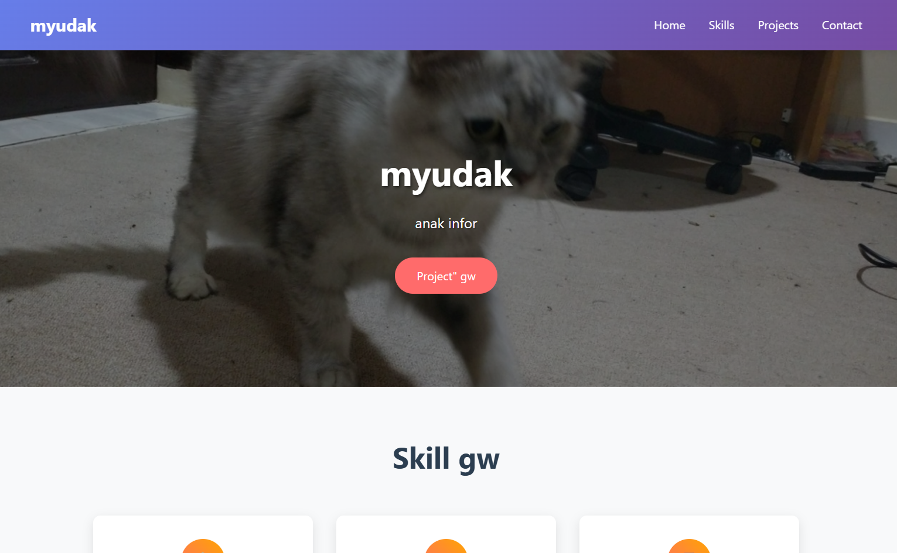
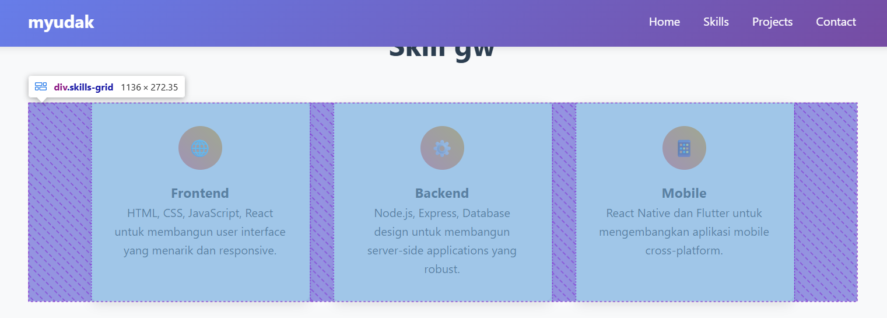

<!-- _class: lead -->
<!-- _header: '' -->
<!-- _footer: '' -->

# Dasar-Dasar HTML & CSS
## Sesi 2: Membangun Struktur & Gaya Web

---

<!-- _class: font-kecil-x -->

## Agenda Sesi Ini

1.  **Apa itu HTML?**
    *   Kerangka Dasar Halaman Web
    *   Struktur Dasar & Sintaks
    *   Elemen-Elemen Umum & Atribut
2.  **Apa itu CSS?**
    *   Memberi Gaya pada Halaman Web
    *   Sintaks Dasar & Selektor
    *   Menghubungkan CSS ke HTML
3.  **Rekap Analogi: HTML + CSS**
4.  **Advanced CSS : Flexbox & Mini Project**
5.  **Intro Slicing**
    *   Dari Desain (Figma) ke Kode (HTML/CSS)
    *   Alur Kerja Umum
6.  **Mini Proyek: Halaman Profil Pribadi**
    *   Tugas, Teknis, & Tips

---

## 1. Apa itu HTML?
### HyperText Markup Language

*   **HTML** adalah bahasa markup standar untuk membuat halaman Web.
*   HTML mendeskripsikan **struktur** dari sebuah halaman Web.
*   HTML terdiri dari serangkaian **elemen**.
*   Elemen HTML memberitahu browser bagaimana cara menampilkan **konten**.

---

## HTML: Sang Kerangka 🦴

Bayangkan HTML sebagai **kerangka** tubuh manusia.
*   Menyediakan struktur fundamental.
*   Mendefinisikan bagian-bagian berbeda (kepala, badan, konten utama, kaki).
*   Tanpanya, tidak ada bentuk atau organisasi yang jelas di halaman web.


---

```html
<body>
  <header>...</header>
  <nav>...</nav>
  <main>
    <article>...</article>
    <aside>...</aside>
  </main>
  <footer>...</footer>
</body>
```
_Kode ini merepresentasikan zona tata letak dasar sebuah halaman web._

---

## HTML: Struktur Dasar & Sintaks

```html
<!DOCTYPE html> <!-- Deklarasi tipe dokumen -->
<html lang="id"> <!-- Elemen root, atribut lang untuk bahasa -->
<head>
    <meta charset="UTF-8"> <!-- Encoding karakter -->
    <meta name="viewport" content="width=device-width, initial-scale=1.0"> <!-- Konfigurasi viewport -->
    <title>Halaman Web Pertamaku</title> <!-- Judul di tab browser -->
</head>
<body> <!-- Konten yang terlihat oleh pengguna -->
    <h1>Halo Dunia!</h1>
    <p>Ini adalah sebuah paragraf.</p>
</body>
</html>
```
*   `<!DOCTYPE html>`: Mendefinisikan tipe dokumen (HTML5).
*   `<html>`: Elemen *root* (akar) dari halaman HTML.
*   `<head>`: Berisi meta-informasi tentang dokumen HTML (tidak ditampilkan).
*   `<body>`: Berisi konten halaman web yang terlihat oleh pengguna.

---

## Elemen & Tag HTML

*   Elemen HTML adalah **blok pembangun** halaman web.
*   Direpresentasikan oleh **tag**.
*   Sebagian besar tag datang berpasangan: **tag pembuka** (`<tag>`) dan **tag penutup** (`</tag>`).
    *   Contoh: `<p>Teks di sini.</p>`
*   Beberapa tag bersifat **self-closing** (atau elemen kosong/void).
    *   Contoh: ``, `<br>`, `<hr>`

**Elemen = Tag Pembuka + Konten + Tag Penutup**
`<p class="contoh">` `Ini adalah konten paragraf.` `</p>`

---
<!-- class: font-sedang -->
## Elemen HTML Umum

*   **Judul (Headings)**: `<h1>` (paling penting) hingga `<h6>` (kurang penting)
*   **Paragraf**: `<p>`
*   **Tautan (Anchor/Link)**: `<a href="https://contoh.com">Klik saya</a>`
*   **Gambar (Image)**: ``
*   **Daftar (Lists)**:
    *   Tidak berurutan (Unordered): `<ul>` dengan `<li>` (item daftar)
    *   Berurutan (Ordered): `<ol>` dengan `<li>`
*   **Pembagian (Divisions)**: `<div>` (kontainer generik untuk pengelompokan dan tata letak)
*   **Span**: `<span>` (kontainer inline generik untuk memberi gaya pada bagian kecil teks)
*   **Semantik**: `<header>`, `<nav>`, `<main>`, `<article>`, `<section>`, `<footer>`, dll.

---

## Atribut HTML

*   Atribut memberikan **informasi tambahan** atau **konfigurasi** untuk sebuah elemen.
*   Selalu ditentukan dalam **tag pembuka**.
*   Biasanya datang dalam pasangan `nama="nilai"`.

Contoh:
*   `href`: Menentukan URL tujuan untuk tag `<a>`.
    *   `<a href="https://www.google.com">Ke Google</a>`
*   `src`: Menentukan sumber (path) file untuk tag ``.
    *   ``
*   `alt`: Teks alternatif untuk `` (penting untuk aksesibilitas & SEO).
*   `class` & `id`: Digunakan untuk identifikasi elemen oleh CSS dan JavaScript.
*   `lang`: Menentukan bahasa konten (misal `lang="id"` pada tag `<html>`).

---

## 2. Apa itu CSS?
### Cascading Style Sheets

*   **CSS** menjelaskan bagaimana elemen HTML akan **ditampilkan** di layar, kertas, atau media lain.
*   CSS mengontrol **tata letak**, **warna**, **font**, dan **tampilan visual** secara keseluruhan.
*   CSS memungkinkan pemisahan antara **konten (HTML)** dan **presentasi (CSS)**.
*   CSS menghemat banyak pekerjaan karena dapat mengontrol gaya beberapa halaman sekaligus.

---

<!-- _class: font-kecil-x, invert -->


## CSS: Kulit & Pakaiannya 👚🎨

Jika HTML adalah kerangka, maka CSS adalah **kulit, rambut, pakaian, dan riasan**.
*   Menentukan penampilan: warna, tekstur, bentuk, ukuran, posisi.
*   Membuat struktur menjadi menarik secara visual, mudah dibaca, dan representatif.


---

```css
body {
  font-family: 'Arial', sans-serif;
  background-color: #f4f4f4;
  color: #333;
}

h1 {
  color: navy;
  text-align: center;
}

.highlight {
  background-color: yellow;
  font-weight: bold;
}
```
_Kode CSS ini memberi gaya pada elemen HTML dasar._

---

## CSS: Sintaks Dasar

Sebuah aturan CSS terdiri dari **selektor** dan **blok deklarasi**:

```css
selektor {
  properti: nilai; /* Ini adalah sebuah deklarasi */
  properti-lain: nilai-lain;
}
```

*   **Selektor (Selector)**: Menunjuk ke elemen HTML yang ingin Anda beri gaya.
*   **Blok Deklarasi (Declaration Block)**: Berisi satu atau lebih deklarasi, diapit kurung kurawal `{}`.
*   **Deklarasi (Declaration)**: Terdiri dari **properti** CSS dan **nilainya**, dipisahkan oleh titik dua `:`, diakhiri titik koma `;`.

---

Contoh:
```css
p {
  color: green;
  font-size: 16px;
}
```
_Aturan ini memilih semua elemen `<p>` dan membuat teksnya berwarna hijau dengan ukuran font 16 piksel._

---

## Selektor CSS Umum

Selektor adalah pola untuk memilih elemen HTML yang akan diberi gaya.

*   **Selektor Elemen (Tipe)**: Memilih elemen berdasarkan nama tag.
    *   `p { ... }` (memilih semua elemen `<p>`)
*   **Selektor ID**: Memilih satu elemen unik berdasarkan atribut `id`. Diawali `#`.
    *   `#header-utama { ... }` (memilih elemen dengan `id="header-utama"`)
*   **Selektor Class**: Memilih elemen berdasarkan atribut `class`. Diawali `.`.
    *   `.tombol-biru { ... }` (memilih semua elemen dengan `class="tombol-biru"`)
*   **Selektor Atribut**: Memilih elemen berdasarkan atribut atau nilai atribut.
    *   `input[type="text"] { ... }`
*   **Selektor Pengelompokan**: Menerapkan gaya yang sama ke beberapa selektor.
    *   `h1, h2, h3 { font-family: 'Georgia', serif; }`

---

## Properti CSS Umum

Beberapa contoh properti CSS yang sering digunakan:

*   `color`: Mengatur warna teks.
*   `background-color`: Mengatur warna latar belakang.
*   `font-family`: Menentukan jenis font untuk teks.
*   `font-size`: Mengatur ukuran font.
*   `font-weight`: Mengatur ketebalan font (e.g., `bold`).
*   `text-align`: Meratakan teks (left, right, center, justify).
*   `width`, `height`: Mengatur lebar dan tinggi elemen.
*   `margin`: Ruang *di luar* batas (border) elemen.
*   `padding`: Ruang *di dalam* batas (border) elemen, antara konten dan border.
*   `border`: Mengatur batas di sekitar elemen (e.g., `border: 1px solid black;`).

---

## Menghubungkan CSS ke HTML

Ada tiga cara untuk menyisipkan CSS ke HTML:

1.  **CSS Eksternal (Sangat Direkomendasikan)**
    *   Definisikan gaya dalam file `.css` terpisah (e.g., `style.css`).
    *   Hubungkan di bagian `<head>` HTML Anda menggunakan tag `<link>`:
        ```html
        <head>
            <link rel="stylesheet" href="style.css">
        </head>
        ```
2.  **CSS Internal**
    *   Tempatkan aturan CSS di dalam tag `<style>`, juga di bagian `<head>`.
        ```html
        <head>
            <style>
                body { background-color: lightblue; }
                h1 { color: navy; }
            </style>
        </head>
        ```

---

3.  **CSS Inline** 
    *   Terapkan gaya langsung ke elemen HTML menggunakan atribut `style`.
        ```html
        <p style="color: red; margin-left: 20px;">Paragraf ini bergaya inline.</p>
        ```

---

## 3. Rekap Analogi: HTML + CSS

*   **HTML (Kerangka 🦴)**: Menyediakan **struktur** dan mendefinisikan **elemen konten**.
    *   `<h1>Judul Websitemu</h1>`
    *   `<p>Selamat datang di situs kerenku.</p>`
    *   ``

*   **CSS (Kulit & Pakaian 🎨)**: Memberi **gaya** pada elemen HTML, membuatnya **menarik secara visual** dan **mudah digunakan**.
    *   Buat `<h1>` berwarna biru dan di tengah.
    *   Atur font untuk `<p>` menjadi Arial.
    *   Beri `` border dan sudut membulat.

**Bersama-sama, HTML & CSS menciptakan halaman web yang lengkap, fungsional, dan enak dipandang!**

---

## 4. CSS Lanjutan: Pengantar Flexbox
### Flexible Box Layout Module

*   **Apa itu Flexbox?** Model layout *satu dimensi* di CSS yang dirancang untuk membantu **mengatur, menyelaraskan, dan mendistribusikan ruang** di antara item-item dalam sebuah container, bahkan ketika ukurannya tidak diketahui atau dinamis (fleksibel).
*   **Mengapa Sangat Penting?**
    *   **Menyederhanakan** pembuatan layout yang kompleks yang dulu sulit dilakukan dengan float atau inline-block.
    *   Membuat **desain responsif** jauh lebih mudah dan intuitif.
    *   Memberikan **kontrol yang presisi** atas alignment (penyelarasan) dan distribusi ruang.
    *   Standar modern untuk layout satu dimensi.


_Sumber Ilustrasi: CSS-Tricks_

---

## Konsep Utama Flexbox: Container & Items

Setiap layout Flexbox terdiri dari dua komponen utama:

1.  **Flex Container**:
    *   Elemen **induk** yang properti `display`-nya diatur ke `flex` atau `inline-flex`.
    *   Ini adalah "kotak" yang akan mengatur anak-anaknya.
2.  **Flex Items**:
    *   Anak-anak **langsung** dari flex container.
    *   Setiap elemen di dalam flex container menjadi flex item.

**Penting!** Properti Flexbox ada yang diterapkan pada **Container** dan ada yang pada **Items**.

---


---

## Sumbu (Axes) dalam Flexbox

Flexbox bekerja berdasarkan dua sumbu utama:

*   **Main Axis (Sumbu Utama)**:
    *   Sumbu utama di mana flex items diletakkan secara berurutan.
    *   Arahnya ditentukan oleh properti `flex-direction` pada container.
    *   Bisa horizontal (default `row`) atau vertikal (`column`).
*   **Cross Axis (Sumbu Silang)**:
    *   Sumbu yang **tegak lurus** dengan main axis.
    *   Jika main axis horizontal, cross axis vertikal, dan sebaliknya.

Memahami kedua sumbu ini krusial untuk menggunakan properti alignment dengan benar.

---


_Sumber Ilustrasi: MDN Web Docs_

---

## Properti Umum untuk Flex Container (1/2)

Ini adalah properti yang Anda terapkan pada elemen *parent* (`display: flex;`).

*   `display: flex;` atau `display: inline-flex;`
    *   `flex`: Container bersifat block-level.
    *   `inline-flex`: Container bersifat inline-level.
*   `flex-direction`: Menentukan arah main axis.
    *   `row` (default): Item berjajar dari kiri ke kanan.
    *   `row-reverse`: Item berjajar dari kanan ke kiri.
    *   `column`: Item tersusun dari atas ke bawah.
    *   `column-reverse`: Item tersusun dari bawah ke atas.
*   `flex-wrap`: Mengontrol apakah item akan "wrap" (pindah baris/kolom) jika tidak muat.
    *   `nowrap` (default): Semua item dipaksa dalam satu baris/kolom (bisa overflow).
    *   `wrap`: Item akan pindah ke baris/kolom baru jika perlu.
    *   `wrap-reverse`: Item akan wrap ke baris/kolom baru dengan urutan terbalik.

---

## Properti Umum untuk Flex Container (2/2)

*   `justify-content`: Menyelaraskan item di sepanjang **MAIN AXIS**.
    *   `flex-start` (default): Item merapat ke awal main axis.
    *   `flex-end`: Item merapat ke akhir main axis.
    *   `center`: Item berada di tengah main axis.
    *   `space-between`: Spasi didistribusikan di antara item; item pertama & terakhir menempel di ujung.
    *   `space-around`: Spasi didistribusikan di sekitar item; item memiliki setengah spasi di ujung.
    *   `space-evenly`: Spasi didistribusikan secara merata di antara semua item, termasuk ujung.
*   `align-items`: Menyelaraskan item di sepanjang **CROSS AXIS**.
    *   `stretch` (default): Item meregang mengisi tinggi/lebar cross axis container.
    *   `flex-start`: Item merapat ke awal cross axis.
    *   `flex-end`: Item merapat ke akhir cross axis.
    *   `center`: Item berada di tengah cross axis.
    *   `baseline`: Item diselaraskan berdasarkan baseline teksnya.
---

## Properti Umum untuk Flex Items

Ini adalah properti yang Anda terapkan pada elemen *children* dari flex container.

*   `order`: Mengubah urutan visual item (default `0`). Nilai lebih kecil tampil lebih dulu.
    *   Contoh: `order: -1;` akan membuat item tampil di paling kiri/atas.
*   `flex-grow`: Faktor seberapa besar item bisa **tumbuh** relatif terhadap item lain jika ada ruang ekstra di main axis (default `0`, artinya tidak tumbuh).
    *   `flex-grow: 1;` berarti item akan mencoba mengisi ruang kosong yang tersedia.
*   `flex-shrink`: Faktor seberapa besar item bisa **menyusut** relatif terhadap item lain jika tidak ada cukup ruang di main axis (default `1`, artinya bisa menyusut).
    *   `flex-shrink: 0;` berarti item tidak akan menyusut.
*   `flex-basis`: Ukuran **awal ideal** item di main axis sebelum ruang didistribusikan (default `auto`). Bisa berupa panjang (`px`, `%`, `em`) atau kata kunci.
*   `align-self`: Memungkinkan penyesuaian alignment item **individual** di cross axis, menimpa `align-items` pada container. Nilainya sama seperti `align-items` (e.g., `center`, `flex-start`).

---

<!-- _class: invert -->

## Kapan Menggunakan Flexbox?

Flexbox sangat ideal untuk:

*   **Komponen UI**: Navigasi, bar tombol, galeri gambar kecil, form, card.
*   **Layout Satu Dimensi**: Mengatur item dalam satu baris atau satu kolom.
*   **Alignment Konten**: Mudah memusatkan elemen secara vertikal dan horizontal.
*   **Distribusi Ruang**: Mengatur spasi antar item secara dinamis.
*   **Layout Responsif**: Mengubah arah (`flex-direction`) atau pembungkusan (`flex-wrap`) item pada ukuran layar berbeda.

Meskipun bisa untuk layout halaman keseluruhan, **CSS Grid** seringkali lebih cocok untuk layout dua dimensi yang kompleks. Keduanya bisa **digunakan bersamaan!**

---

## 4.1 Slicing & Mini Proyek
### Menerapkan Teori ke Praktik

Sekarang kita akan melihat contoh desain yang akan menjadi dasar untuk:
1.  **Demo Live Coding (jika ada waktu)**: Saya akan menunjukkan bagaimana memulai slicing desain ini menggunakan HTML, CSS dasar, dan **Flexbox**.
2.  **Mini Proyek Anda**: Anda akan diminta untuk membuat ulang (atau terinspirasi dari) desain serupa sebagai latihan.

Tujuannya adalah mengaplikasikan konsep HTML, CSS, dan terutama Flexbox yang baru saja kita pelajari.

---
<!-- _class: case-study-image -->

## Studi Kasus Desain Mini Proyek

Berikut adalah contoh desain yang akan kita gunakan sebagai acuan atau inspirasi untuk mini proyek. Perhatikan bagaimana elemen-elemen tersusun, bagaimana spasi digunakan, dan bagian mana saja yang bisa diatur menggunakan Flexbox.



---



---
<!-- _class: font-kecil-x -->

## Analisis Awal Desain (Contoh)

Dari tampilan desain di atas, kita bisa mulai memikirkan strukturnya seperti ini:


### 🧱 Struktur HTML

* Ada sebuah **section** berjudul *"Skill gw"*.
* Di dalamnya, terdapat sebuah **wadah utama** (mungkin pakai `div`) yang membungkus tiga **kartu skill**: Frontend, Backend, dan Mobile.
* Setiap kartu punya:

  * Icon di bagian atas,
  * Judul skill,
  * Deskripsi singkat.

---

### 🎨 Tata Letak (CSS)

* Kita bisa membayangkan menggunakan **Flexbox** sebagai dasar layout.
* Wadah utama tadi bisa kita jadikan sebagai **flex container**.
* Dengan Flexbox, kita bisa mengatur:

  * Posisi setiap kartu agar sejajar secara horizontal (menggunakan `justify-content: space-between` atau `center`).
  * Jarak antar kartu bisa pakai `gap`.
  * Tiap kartu punya ukuran yang merata (misalnya pakai `flex-grow`).
* Bagian dalam setiap kartu bisa diatur agar **kontennya rata tengah**.

---

### ✅ Kesimpulan

Jadi, dari desain ini, kita bisa menyimpulkan bahwa:

* Kita cukup gunakan struktur HTML sederhana dengan `div`.
* Tata letaknya bisa disusun menggunakan **Flexbox**.
* Penataan dan spacing antar elemen akan sangat terbantu dengan properti Flexbox seperti `justify-content`, `align-items`, dan `gap`.


---

## 5. Pengantar Slicing
### Dari Desain (Figma) ke Kode (HTML/CSS)

**Apa itu "Slicing"?**

Slicing adalah proses mengambil *mockup* (rancangan) desain visual statis—sering dibuat di alat seperti **Figma**, Adobe XD, atau Sketch—dan **mengubahnya menjadi kode HTML dan CSS yang fungsional dan interaktif.**

**Intinya: Desain (Gambar/Visual) ➡️ Kode (Halaman Web Nyata)**

 _(Konsep: UI Figma di kiri, kode di kanan)_

---

## Mengapa Slicing? Alur Kerjanya

1.  **Tahap Desain (UI/UX Designer)**:
    *   Membuat representasi visual website/aplikasi di Figma.
    *   Termasuk tata letak, warna, tipografi, gambar, ikon, dan kadang interaksi dasar.
2.  **Tahap Pengembangan (Developer)**:
    *   Developer mengambil desain ini dan "memotong" (melakukan slicing).
    *   **Menulis HTML** untuk menyusun konten sesuai struktur desain.
    *   **Menulis CSS** untuk memberi gaya pada HTML agar sesuai tampilan visual dari Figma.
    *   **Mengekspor aset** (gambar, ikon) dari Figma.

**Tujuan**: Membuat halaman web yang **pixel-perfect** atau setidaknya sangat mirip dengan desain orisinal, baik secara visual maupun fungsional (untuk bagian statis).

---

## Figma ke HTML/CSS: Proses Umum

1.  **Analisis Desain (di Figma)**:
    *   Pahami tata letak: header, navigasi, hero section, konten, footer, dll.
    *   Identifikasi komponen yang dapat digunakan kembali (tombol, kartu, input form).
    *   Catat detail:
        *   **Tipografi**: Font family, size, weight, line-height, letter-spacing.
        *   **Warna**: Kode HEX, RGB, atau HSL.
        *   **Spasi**: Margin, padding antar elemen.
        *   **Ukuran**: Lebar, tinggi elemen.
    *   Gunakan panel **Inspect** di Figma!

2.  **Rencanakan Struktur HTML**:
    *   Pikirkan secara **semantik**: `<header>`, `<nav>`, `<main>`, `<section>`, `<footer>`.
    *   Gunakan `<div>` untuk pengelompokan non-semantik atau untuk keperluan styling/layout.
    *   Berikan `class` (dan `id` jika perlu) yang deskriptif untuk targeting CSS.

---

## Figma ke HTML/CSS: Proses Umum (Lanjutan)

3.  **Ekstrak Aset dari Figma**:
    *   **Gambar** (foto, ilustrasi): Ekspor sebagai JPG (untuk foto), PNG (jika butuh transparansi), atau WebP (format modern, kualitas baik & ukuran kecil).
    *   **Ikon**: Idealnya ekspor sebagai **SVG** (Scalable Vector Graphics) – tajam di berbagai ukuran.
    *   Figma memiliki fitur "Export" yang mudah digunakan (pilih layer/grup, klik '+' di panel Export).

4.  **Tulis Kode HTML**:
    *   Mulai dari struktur dasar halaman.
    *   Bangun bagian per bagian sesuai analisis desain.

5.  **Tulis Kode CSS**:
    *   Hubungkan file CSS eksternal Anda.
    *   Mulai dengan gaya global (reset/normalize jika perlu, body, tipografi dasar).
    *   Styling bagian per bagian, komponen per komponen, mengacu pada nilai dari Figma.
    *   **Terus-menerus uji di browser** dan bandingkan dengan desain Figma. Gunakan Developer Tools!

---
<!-- _class: invert -->

## Contoh Slicing Sederhana (Konseptual)

**Desain Figma:** Kartu sederhana dengan gambar, judul, dan teks.

 _(Bayangkan desain kartu sederhana di sini)_

**Struktur HTML (Kerangka):**
```html
<div class="kartu">
  
  <div class="kartu-konten">
    <h3 class="kartu-judul">Judul Kartu dari Figma</h3>
    <p class="kartu-teks">Teks deskriptif singkat dari desain.</p>
  </div>
</div>
```

**CSS (Styling - nilai dari Figma Inspect):**
```css
.kartu {
  width: 300px; /* Dari Figma */
  border: 1px solid #E0E0E0; /* Dari Figma */
  border-radius: 8px; /* Dari Figma */
  box-shadow: 0 2px 4px rgba(0,0,0,0.1); /* Dari Figma */
  overflow: hidden; /* Agar border-radius gambar bekerja */
}
.kartu-gambar { width: 100%; display: block; }
.kartu-konten { padding: 16px; /* Dari Figma */ }
.kartu-judul { font-size: 20px; color: #333; margin-top: 0; margin-bottom: 8px; /* Dari Figma */ }
.kartu-teks { font-size: 14px; color: #666; line-height: 1.5; /* Dari Figma */ }
```

---
<!-- _class: mini-proyek -->

## 5. Mini Proyek: Halaman Profil Pribadi
### Saatnya Praktik!

**Tugas Anda:**
*   Buat satu halaman web statis yang berfungsi sebagai **profil pribadi** sederhana.
*   Konten minimal:
    *   Foto Anda (atau placeholder jika tidak nyaman)
    *   Nama Lengkap Anda
    *   Bio singkat (tentang Anda, minat, atau status saat ini)
    *   Beberapa tautan (misal: ke sosial media, GitHub, portofolio jika ada)
*   **Desain bebas!** Anda bisa mencari inspirasi atau membuat desain sederhana sendiri.

---
<!-- _class: mini-proyek -->

## Mini Proyek: Teknis & Tips

**Persyaratan Teknis:**
*   Gunakan **HTML** untuk struktur konten.
*   Gunakan **CSS Eksternal** (`.css` file) untuk semua styling.
*   Buat **repositori baru** di akun GitHub Anda untuk proyek ini.
*   **Commit & push** kode Anda secara berkala ke repositori GitHub.
*   **(Opsional - Nilai Plus!)** Deploy halaman Anda menggunakan **GitHub Pages** agar bisa diakses online.

**Tips:**
*   Mulai dengan struktur **HTML** terlebih dahulu (kerangkanya).
*   Kemudian, tambahkan style **CSS** sedikit demi sedikit.
*   Gunakan **Developer Tools** di browser untuk inspect dan debug.
*   Jangan takut untuk **bereksperimen** dan mencari referensi!
*   **Deadline:** [Sebutkan deadline di sini, misal: Awal Sesi Berikutnya]

---

## 6. Alat Bantu Slicing & Pengembangan

*   **Figma**: Melihat desain, inspect properti (warna, font, spasi), export aset.
*   **Editor Kode**:
    *   **Visual Studio Code (VS Code)**: Sangat direkomendasikan! Gratis, banyak ekstensi (Live Server, Prettier, IntelliSense).
    *   Alternatif: Sublime Text, Atom, WebStorm (berbayar).
*   **Browser Web**:
    *   Google Chrome, Firefox, Edge, Safari.
    *   WAJIB gunakan **Developer Tools** (klik kanan > Inspect / Periksa) untuk debugging HTML & CSS.
*   **(Nantinya)** **Git & GitHub/GitLab/Bitbucket**: Untuk kontrol versi & kolaborasi.

---
<!-- _class: font-sedang -->

## Poin Penting & Langkah Selanjutnya

**Poin Penting dari Sesi Ini:**
*   HTML adalah **struktur**, CSS adalah **presentasi/gaya**.
*   Pahami sintaks dasar keduanya.
*   Biasakan menggunakan **selektor CSS** yang tepat.
*   Slicing adalah **menerjemahkan desain visual ke kode**.
*   **Panel Inspect Figma** dan **Developer Tools Browser** adalah teman terbaik Anda!

**Langkah Selanjutnya (Sesi Berikutnya):**
*   Mendalami CSS lebih lanjut:
    *   **CSS Box Model** (margin, border, padding, content)
    *   **CSS Positioning** (static, relative, absolute, fixed, sticky)
    *   Pengenalan **Flexbox** dan/atau **Grid** untuk layout modern.

---
<!-- _class: lead -->

## Ada Pertanyaan?

Mari berdiskusi!

---
<!-- _class: invert -->

# Terima Kasih!

Selamat Belajar & Selamat Ngoding!
Jangan ragu untuk bertanya jika ada kesulitan dengan Mini Proyek.